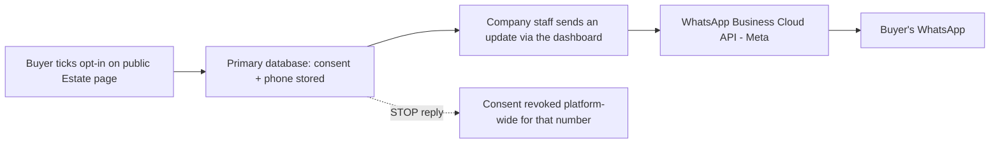

# Data Map

**DRAFT - prepared 27 September 2026 for review by a Nigerian lawyer. Not yet reviewed by
counsel. Internal reference document, also useful for answering a customer's or an auditor's
question about where a particular piece of data lives.**

This maps *what* is stored, *where* (which system, hosted by whom, in what region), and *why* -
the companion to `RECORDS_OF_PROCESSING_ACTIVITIES.md`, which maps *purpose and legal basis*
instead. Read alongside `DATA_PROCESSING_AGREEMENT.md` clause 7 for the same list framed as
Sub-processor commitments.

## 1. Systems inventory

| System | What it stores | Hosted by / region | Why LandCheck uses it | Personal data present? |
|---|---|---|---|---|
| Primary database (PostgreSQL + PostGIS) | Every record in the Platform: estates, plots, customers, reservations, allocations, payments records, sales-agent commissions, staff accounts, sessions, audit trail, marketing posts and plans, WhatsApp opt-ins, plot/estate boundary geometry | **[hosting provider and region - fill in]** | The system of record for the whole Platform | Yes - the largest concentration of personal data |
| Cloudflare R2 (object storage) | Uploaded documents: survey plans, title documents, layout drawings, estate/company logos, generated marketing images and PDFs | Cloudflare, Inc. - global edge network, S3-compatible storage | Storing and serving files too large or unstructured for the database | Sometimes - a document may contain a name or signature; images are auto-generated from a Company's own plot/price data |
| Google Earth Engine | Satellite imagery and derived land-cover/hazard analysis for an estate's coordinates | Google LLC | Flood/erosion hazard screening; growth/land-value outlook | No - inputs are boundary coordinates, not personal data |
| Mapbox | Map tiles, satellite basemaps, geocoding | Mapbox, Inc. | Rendering the interactive map in the dashboard and on public Estate pages | No |
| Flutterwave | Payment processing for LandCheck Estates subscriptions; a tokenised card reference, last 4 digits and card brand are returned to LandCheck | Flutterwave Technology Solutions Limited (Nigeria) | Billing the Company for its subscription | Yes - billing contact details; no full card numbers ever reach LandCheck |
| Meta Graph API (Facebook & Instagram) | OAuth access tokens (stored encrypted) for a Company's connected Facebook Page and Instagram Business account; post content and images | Meta Platforms, Inc. | Automatic and manual publishing of marketing posts the Company approves | Indirectly - tokens identify an account the Company controls; posts are made of the Company's own plot/price data |
| WhatsApp Business Cloud API (Meta) | Phone numbers and names of buyers who opted in; consent record and timestamp; message delivery status | Meta Platforms, Inc. | Sending opted-in buyers WhatsApp updates about new plots, prices, and inspections | Yes - phone numbers and (optionally) names |
| Email / SMTP | Recipient name and email address; content of transactional emails (receipts, reservation notices, reminders, billing notices) | **[SMTP/email provider - fill in]** | Transactional email delivery | Yes |
| Server / application runtime | Application logs, in-memory session data, the encryption key used for stored tokens | **[server/hosting provider and region - fill in]** | Running the Platform itself | Indirectly - logs may incidentally contain identifiers such as an email address in a request path |

## 2. Where each category of personal data lives

| Category of personal data | Primary system | Also appears in |
|---|---|---|
| Land buyer / customer name, phone, email, address | Primary database | Generated documents/PDFs (R2), transactional emails, WhatsApp messages (phone only) |
| Sales-agent details and commission records | Primary database | - |
| Company staff login (name, email, hashed password) | Primary database | Audit trail entries reference the staff member's name |
| Payment/billing contact and tokenised card reference | Primary database (token only) | Flutterwave (holds the actual card details) |
| WhatsApp opt-in consent, phone number | Primary database | Meta (WhatsApp Cloud API, to send the message) |
| Facebook/Instagram account access tokens | Primary database (encrypted column) | Meta (the token authorises LandCheck to act on the Company's connected account) |
| Uploaded documents that may contain a name/signature | Cloudflare R2 | Primary database (metadata: filename, uploader, timestamp) |
| Estate/plot boundary coordinates | Primary database | Google Earth Engine and Mapbox receive coordinates for analysis/display, not classed as personal data on their own |

## 3. Data flow (buyer opts in to a WhatsApp update, as an example)

## 4. Retention and deletion

Retention follows `RECORDS_OF_PROCESSING_ACTIVITIES.md`'s per-activity table and
`DATA_PROCESSING_AGREEMENT.md` clause 10. In short: a Company's own records live for as long as
the Company keeps them (it can delete a customer, cancel an opt-in, or remove a document at any
time through the Platform); on account closure, LandCheck retains Company Personal Data for
**[90 days - confirm with counsel]** before deleting it, except where a longer period is required
by law (for example, payment records for tax purposes).

## 5. Keeping this map current

Update this file, `RECORDS_OF_PROCESSING_ACTIVITIES.md`, and
`DATA_PROCESSING_AGREEMENT.md` clause 7 together whenever LandCheck adds a new third-party service
that can see personal data, or starts collecting a new category of personal data. A mismatch
between these three documents is itself a compliance gap.
